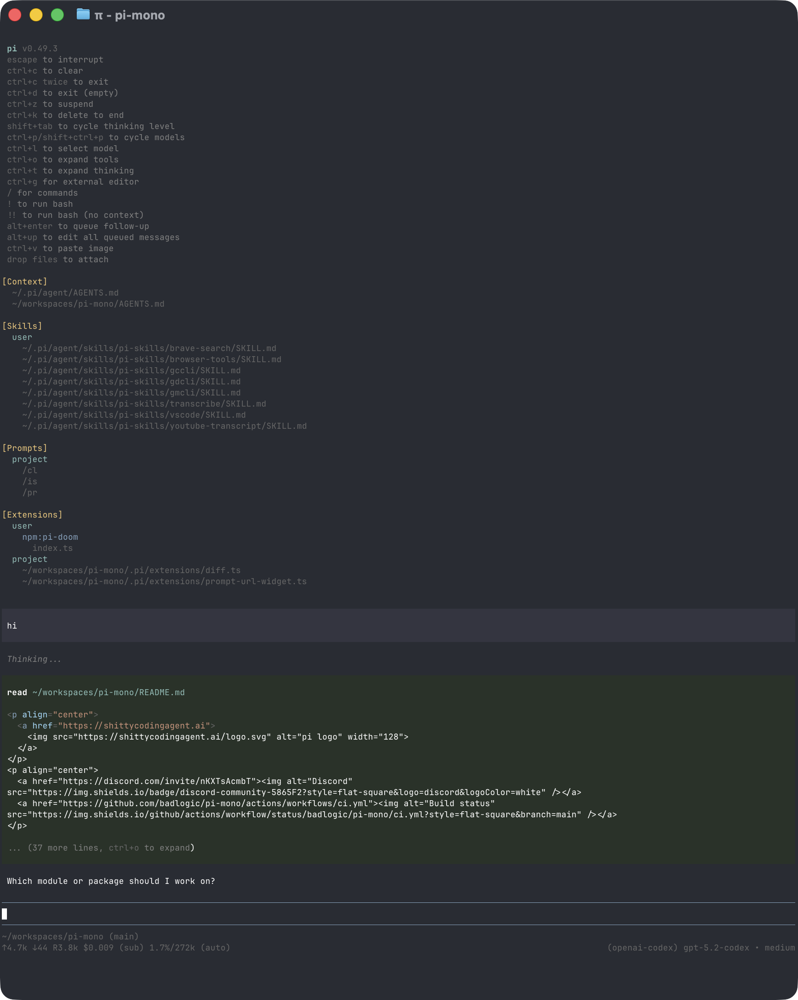

# Using Pi

This page collects day-to-day usage details that do not fit on the quickstart page.

## Interactive Mode

<p align="center"></p>

The interface has four main areas:

- **Startup header** - shortcuts, loaded context files, prompt templates, skills, and extensions
- **Messages** - user messages, assistant responses, tool calls, tool results, notifications, errors, and extension UI
- **Editor** - where you type; border color indicates the current thinking level
- **Footer** - working directory, session name, token/cache usage, cost, context usage, and current model. Totals include assistant responses, usage reported by tools, and summary generation.

The editor can be replaced temporarily by built-in UI such as `/settings` or by custom extension UI.

### Editor Features

| Feature | How |
|---------|-----|
| File reference | Type `@` to fuzzy-search project files |
| Path completion | Press Tab to complete paths |
| Multi-line input | Shift+Enter, or Ctrl+Enter on Windows Terminal |
| Copy response | Ctrl+X copies the selected message in `/tree`; otherwise it copies the last assistant message, or the active fullscreen text selection when `fullscreenCopyOnSelect` is disabled |
| Images | Paste with Ctrl+V, Alt+V on Windows, or drag into the terminal |
| Shell command | `!command` runs and sends output to the model |
| Hidden shell command | `!!command` runs without sending output to the model |
| External editor | Ctrl+G opens `externalEditor`, `$VISUAL`, `$EDITOR`, Notepad on Windows, or `nano` elsewhere |

See [Keybindings](keybindings.md) for all shortcuts and customization.

## Slash Commands

Type `/` in the editor to open command completion. Extensions can register custom commands, skills are available as `/skill:name`, and prompt templates expand via `/templatename`.

| Command | Description |
|---------|-------------|
| `/login`, `/logout` | Manage OAuth or API-key credentials |
| [`/llama`](llama-cpp.md) | Download, load, and unload llama.cpp router models |
| [`/mcp`](mcp.md) | Manage MCP servers, authentication, tools, and resources |
| [`/btw [question]`](bundled/extensions/btw.md) | Open a temporary side conversation using the current context |
| `/model` | Switch models; Ctrl+S in the picker saves the startup default |
| `/thinking` | Switch thinking level; Ctrl+S in the picker saves the startup default |
| `/scoped-models` | Enable/disable models for Ctrl+P cycling |
| `/settings` | Theme, message delivery, transport, and other preferences |
| `/resume` | Pick from previous sessions |
| `/new` | Start a new session |
| `/name <name>` | Set session display name |
| `/session` | Show session file, ID, messages, tokens, and cost |
| `/tree` | Jump to any point in the session and continue from there |
| `/trust` | Save project trust decision for future sessions |
| `/fork` | Create a new session from a previous user message |
| `/clone` | Duplicate the current active branch into a new session |
| `/compact [prompt]` | Manually compact context, optionally with custom instructions |
| `/copy` | Copy last assistant message to clipboard |
| `/export [file]` | Export session to HTML or JSONL |
| `/import <file>` | Import and resume a session from a JSONL file |
| `/share` | Upload as private GitHub gist with shareable HTML link |
| `/bug [description]` | Report a bug to the Pi developers; see [Sessions](sessions.md#reporting-bugs) |
| `/reload` | Reload keybindings, extensions, skills, prompts, themes, and context files |
| `/hotkeys` | Show all keyboard shortcuts |
| `/changelog` | Display version history |
| `/quit` | Quit pi |

## Message Queue

You can submit messages while the agent is still working:

- **Enter** queues a steering message, delivered after the current assistant turn finishes executing its tool calls.
- **Alt+Enter** queues a follow-up message, delivered after the agent finishes all work.
- **Escape** aborts and restores queued messages to the editor.
- **Alt+Up** retrieves queued messages back to the editor.

On Windows Terminal, Alt+Enter is fullscreen by default. Remap it as described in [Terminal setup](terminal-setup.md) if you want pi to receive the shortcut.

Configure delivery in [Settings](settings.md) with `steeringMode` and `followUpMode`.

While the [BTW panel](bundled/extensions/btw.md) is open, ordinary editor submissions go to that side conversation. Busy side questions remain drafts instead of entering the main queue.

## Sessions

Sessions are saved automatically to `~/.pi/agent/sessions/`, organized by working directory.

```bash
pi -c                  # Continue most recent session
pi -r                  # Browse and select a session
pi --no-session        # Ephemeral mode; do not save
pi --name "my task"    # Set session display name at startup
pi --session <path|id> # Use a specific session file or session ID
pi --fork <path|id>    # Fork a session into a new session file
```

See [Sessions](sessions.md) and [Compaction](compaction.md) for session commands and behavior.

## Context Files

Pi loads `AGENTS.md` or `CLAUDE.md` at startup from:

- `~/.pi/agent/AGENTS.md` for global instructions
- parent directories, walking up from the current working directory
- the current directory

If a directory contains `AGENTS.override.md`, Pi loads it instead of `AGENTS.md` or `CLAUDE.md` from that directory. Context files from other directories still layer normally.

Use context files for project conventions, commands, safety rules, and preferences. Disable loading with `--no-context-files` or `-nc`.

### System Prompt Files

Replace the default system prompt with:

- `.pi/SYSTEM.md` for a project
- `~/.pi/agent/SYSTEM.md` globally

Append to the default prompt without replacing it with `APPEND_SYSTEM.md` in either location.

### Project Trust

On interactive startup, pi asks before trusting a project folder that contains project-local settings, resources, or project `.agents/skills` and has no saved decision for the folder or a parent folder in `~/.pi/agent/trust.json`. Trusting a project allows pi to load `.pi/settings.json` and `.pi` resources, install missing project packages, and execute project extensions.

Before the trust decision, pi loads only context files, user/global extensions, and CLI `-e` extensions so they can handle the `project_trust` event. Project-local extensions, project package-managed extensions, and project settings are loaded only after the project is trusted. This split also applies when switching to a session from a different cwd whose trust has not been resolved in the current process.

Non-interactive modes (`-p`, `--mode json`, and `--mode rpc`) do not show a trust prompt. Without an applicable saved trust decision, they use `defaultProjectTrust` from global settings: `ask` (default) and `never` ignore those project resources, while `always` trusts them. Pass `--approve`/`-a` or `--no-approve`/`-na` to override project trust for one run.

If no extension or saved decision applies, `defaultProjectTrust` controls the fallback behavior. Set it to `"ask"`, `"always"`, or `"never"` in `~/.pi/agent/settings.json`, or change it with `/settings`.

`pi config` and package commands use the same project trust flow, except `pi update` never prompts. Pass `--approve` to trust project-local settings for one command or `--no-approve` to ignore them.

Use `/trust` in interactive mode to save a project trust decision for future sessions, including trust for the immediate parent folder. It writes `~/.pi/agent/trust.json` only; the current session is not reloaded, so restart pi for changes to take effect.


## Exporting and Sharing Sessions

Use `/export [file]` to write a session to HTML.

Use `/share` to upload a private GitHub gist with a shareable HTML link.

If you use pi for open source work and want to publish sessions for model, prompt, tool, and evaluation research, see [`badlogic/pi-share-hf`](https://github.com/badlogic/pi-share-hf). It publishes sessions to Hugging Face datasets.

## CLI Reference

```bash
pi [options] [--] [@files...] [messages...]
```

### Package Commands

```bash
pi install <source> [-l]     # Install package, -l for project-local
pi remove <source> [-l]      # Remove package
pi uninstall <source> [-l]   # Alias for remove
pi update [source|self|pi]   # Update pi only, or one package source
pi update --all              # Update pi and packages; reconcile pinned git refs
pi update --extensions       # Update packages only; reconcile pinned git refs
pi update --models           # Refresh model catalogs only
pi update --self             # Update pi only
pi update --extension <src>  # Update one package
pi list                      # List installed packages
pi config                    # Enable/disable package resources
```

To uninstall pi itself, see [Quickstart](quickstart.md#uninstall). `pi config` and project package commands accept `--approve`/`--no-approve` to trust or ignore project-local settings for one command. `pi update` never prompts for project trust.

See [Pi Packages](packages.md) for package sources and security notes.

### Modes

| Flag | Description |
|------|-------------|
| default | Interactive mode |
| `-p`, `--print` | Print response and exit |
| `--mode text` | Text output; still opens the terminal UI when stdin and stdout are terminals |
| `--mode json` | Output all events as JSON lines; see [JSON mode](json.md) |
| `--mode rpc` | RPC mode over stdin/stdout; see [RPC mode](rpc.md) |
| `--export <in> [out]` | Export a session to HTML |

`--mode` accepts only `text`, `json`, or `rpc`. A missing or invalid value is reported as an error and pi exits with a nonzero status instead of falling back to another mode.

In print mode, pi also reads piped stdin and merges it into the initial prompt:

```bash
cat README.md | pi -p "Summarize this text"
```

### Model Options

| Option | Description |
|--------|-------------|
| `--provider <name>` | Provider to search for `--model`, such as `anthropic` or `openai`; requires `--model` |
| `--model <pattern>` | Model pattern or ID; supports `provider/id` and optional `:<thinking>` |
| `--api-key <key>` | API key, overriding environment variables |
| `--thinking <level>` | `off`, `minimal`, `low`, `medium`, `high`, `xhigh`, `max` |
| `--models <patterns>` | Comma-separated patterns for Ctrl+P cycling |
| `--list-models [search]` | List available models |

### Session Options

| Option | Description |
|--------|-------------|
| `-c`, `--continue` | Continue the most recent session |
| `-r`, `--resume` | Browse and select a session |
| `--session <path\|id>` | Use a specific session file or partial UUID |
| `--fork <path\|id>` | Fork a session file or partial UUID into a new session |
| `--session-dir <dir>` | Custom session storage directory |
| `--no-session` | Ephemeral mode; do not save |
| `--name <name>`, `-n <name>` | Set session display name at startup |

### Tool Options

| Option | Description |
|--------|-------------|
| `--tools <list>`, `-t <list>` | Allowlist specific built-in, extension, and custom tools; entries are names or `*` patterns, and MCP tools are kept unless an entry starts with `mcp__`. A list of only `+name` and `-name` entries changes the default selection instead |
| `--exclude-tools <list>`, `-xt <list>` | Disable tools by name or `*` pattern, MCP tools included |
| `--no-builtin-tools`, `-nbt` | Disable built-in tools but keep extension/custom tools enabled |
| `--no-tools`, `-nt` | Disable all tools, MCP tools included |

Built-in tools: `read`, `bash`, `powershell` (Windows), `edit`, `write`, `grep`, `find`, `ls`.

Like `defaultTools`, `--tools` also accepts a list of only `+name` and `-name` entries, which adds tools to or removes them from the default selection: `pi --tools +codemode,-write` keeps the other default tools, enables `codemode`, and disables `write`. These entries take exact tool names, not `*` patterns; use `--exclude-tools` to disable tools by pattern. Plain names and `+name`/`-name` entries cannot be mixed. `/reload` enables tools newly added to `defaultTools`, but a tool removed with `-name` stays removed.

`--tools` selects the tools declared to the model. It does not remove MCP tools, whose reach is set by their [exposure](mcp.md#control-tool-exposure): `pi --tools read,codemode` keeps every MCP tool callable from codemode scripts. An MCP tool that no entry names or matches is never declared directly, whatever its exposure; only `tool_search`, if listed, can load it. Once an entry starts with `mcp__`, `--tools` filters MCP tools too, so this keeps only the tools of the `radius` server:

```bash
pi --tools read,bash,codemode,'mcp__radius__*'
```

The MCP resource tools (`list_mcp_resources`, `list_mcp_resource_templates`, `read_mcp_resource`) count as MCP tools. To remove MCP tools, use `--exclude-tools 'mcp__*'` or `--no-mcp`.

### Resource Options

| Option | Description |
|--------|-------------|
| `-e`, `--extension <source>` | Load an extension from path, npm, git, or `builtin:<name>`; repeatable |
| `--no-extensions` | Disable discovered, configured, and built-in extensions; explicit `-e` entries still load |
| `--no-mcp` | Disable built-in MCP support for this run: no servers connect, and there are no MCP tools or `/mcp`; does not affect an extension that replaces the built-in MCP support |
| `--skill <path>` | Load a skill; repeatable |
| `--no-skills` | Disable skill discovery |
| `--prompt-template <path>` | Load a prompt template; repeatable |
| `--no-prompt-templates` | Disable prompt template discovery |
| `--theme <path>` | Load a theme; repeatable |
| `--no-themes` | Disable theme discovery |
| `--no-context-files`, `-nc` | Disable `AGENTS.md` and `CLAUDE.md` discovery |

Combine `--no-*` with explicit flags to load exactly what you need, ignoring settings. Example:

```bash
pi --no-extensions -e ./my-extension.ts
```

### Other Options

| Option | Description |
|--------|-------------|
| `--system-prompt <text>` | Replace default prompt; context files and skills are still appended |
| `--append-system-prompt <text>` | Append to system prompt |
| `--tui-mode <mode>` | TUI mode: `fullscreen` (default) or `regular` |
| `--use-theme <name[/name]>` | Set the initial interactive theme for this run without changing settings |
| `--verbose` | Force verbose startup |
| `-a`, `--approve` | Trust project-local files for this run |
| `-na`, `--no-approve` | Ignore project-local files for this run |
| `--` | Stop option parsing; remaining arguments are prompts or `@file` inputs |
| `-h`, `--help` | Show help |
| `-v`, `--version` | Show version |

In `fullscreen` mode, the transcript scrolls inside the terminal viewport while queued messages, working status, extension widgets, editor, and footer remain fixed at the bottom. Mouse/trackpad input scrolls the region under the pointer; keyboard viewport actions always remain available. Inline images work in terminals that support the Kitty graphics protocol, including Kitty and Ghostty. In iTerm2 they render as text placeholders because its inline-image protocol cannot delete or crop placements during application-owned scrolling. In `regular` mode, pi uses the main screen and terminal-owned scrollback, and iTerm2 inline images continue to render normally. See [Terminal setup](terminal-setup.md) for terminal-specific settings and workarounds.

Set **TUI mode** in `/settings` to switch between `regular` and `fullscreen` immediately and choose the default for future sessions. **Fullscreen exit output** controls whether exiting fullscreen prints the final transcript or restores the previous screen and prints only the session resume hint.

### File Arguments

Prefix files with `@` to include them in the message:

```bash
pi @prompt.md "Answer this"
pi -p @screenshot.png "What's in this image?"
pi @code.ts @test.ts "Review these files"
```

### Examples

```bash
# Interactive with initial prompt
pi "List all .ts files in src/"

# Non-interactive
pi -p "Summarize this codebase"

# Prompt beginning with a dash
pi -p -- "- Summarize these points"

# Non-interactive with piped stdin
cat README.md | pi -p "Summarize this text"

# Named one-shot session
pi --name "release audit" -p "Audit this repository"

# Different model
pi --provider openai --model gpt-4o "Help me refactor"

# Model with provider prefix
pi --model openai/gpt-4o "Help me refactor"

# Model with thinking level shorthand
pi --model sonnet:high "Solve this complex problem"

# Limit model cycling
pi --models "claude-*,gpt-4o"

# Read-only mode
pi --tools read,grep,find,ls -p "Review the code"

# Codemode with only the tools of one MCP server
pi --tools read,bash,codemode,'mcp__radius__*'

# Disable one extension or built-in tool while keeping the rest available
pi --exclude-tools ask_question
```

## Design Principles

Pi keeps the core small and pushes workflow-specific behavior into extensions, skills, prompt templates, and packages.

Upstream Pi provides the llama.cpp integration, codemode, MCP, and tool search. This distribution adds Tasks, BTW, other workflow extensions, and its native tool presentation. See the [feature catalog](bundled/README.md) for their origins and usage. You can build or install additional workflows as extensions or packages.

For the full rationale, read the [blog post](https://mariozechner.at/posts/2025-11-30-pi-coding-agent/).

## Codemode and tool search

Codemode and tool search are built-in extensions from [upstream Pi](https://github.com/earendil-works/pi), included in `@astralyn/pi`. Both tools are inactive by default; enable them explicitly or let the MCP extension activate them when needed.

### Enable codemode

To turn on `codemode` for every session, add it to the default tools in `~/.pi/agent/settings.json` or a project's `.pi/settings.json`:

```json
{
  "defaultTools": ["+codemode"]
}
```

This keeps `read`, `bash`, `edit`, and `write` and adds `codemode`. For one invocation, add it with `--tools`:

```sh
pi --tools +codemode
```

Codemode is useful without MCP: scripts can run several tool calls in parallel, filter large output before it reaches the model, call classifier models such as TypeSafe's Jev through `models.classify()` (see [Classifier models](models.md#use-classifier-models)), and generate images through `models.generateImages()` (see [Image models](models.md#use-image-models)).

### How codemode works

Scripts run in a QuickJS sandbox and reach the other tools through `tools.<name>(args)`. [Codemode](codemode.md) describes the script API, how tools are listed and found, the `store()` and `models` globals, and the limits.

### Tool search

`tool_search` is off by default; enable it with `"defaultTools": ["+tool_search"]` or `--tools`. It uses the same ranking as `searchTools()` over tools that are not declared yet and declares the matches for the next model call. Loaded tools are recorded in the session like other tool changes, so they stay declared on that branch.

## MCP commands

These commands work outside a session, so agents can run them through `bash`. See [MCP Servers](mcp.md).

| Command | Description |
|---|---|
| `pi mcp add <server> [options] -- <command> [args...]` | Add or replace a stdio server in `mcp.json`; `--env KEY=VALUE` (repeatable) and `--cwd <dir>` set its environment and working directory. Arguments after the command are passed to it |
| `pi mcp add <server> [options] --url <url>` | Add or replace a streamable HTTP server; `--header KEY=VALUE` (repeatable), `--bearer-token-env-var <NAME>` (sends `Authorization: Bearer ${NAME}`), `--oauth-client-id`, `--oauth-client-secret`, `--oauth-callback-port`, and `--oauth-client-name` configure authentication |
| `pi mcp remove <server>` | Remove a server from `mcp.json`; stored OAuth credentials are kept |
| `pi mcp list [--json]` | Connect to every enabled server and print its state, tools, and errors; exit with `1` when a config entry is invalid or an enabled server is not connected |
| `pi mcp login <server> [--timeout <seconds>]` | Sign in to an OAuth server: open the authorization page and wait for the browser (default 300 seconds); a terminal also accepts the pasted redirect URL |
| `pi mcp logout <server>` | Delete the stored OAuth credentials of a server |

`add` and `remove` change `~/.pi/agent/mcp.json`, or `.pi/mcp.json` in the current directory with `--local` (`-l`). `add` also takes `--exposure <mode>` (see [Exposure](mcp.md#exposure)) and `--description <text>` and does not connect; run `pi mcp list` to check the server.

Project `.pi/mcp.json` files are only read for projects that are already trusted.
